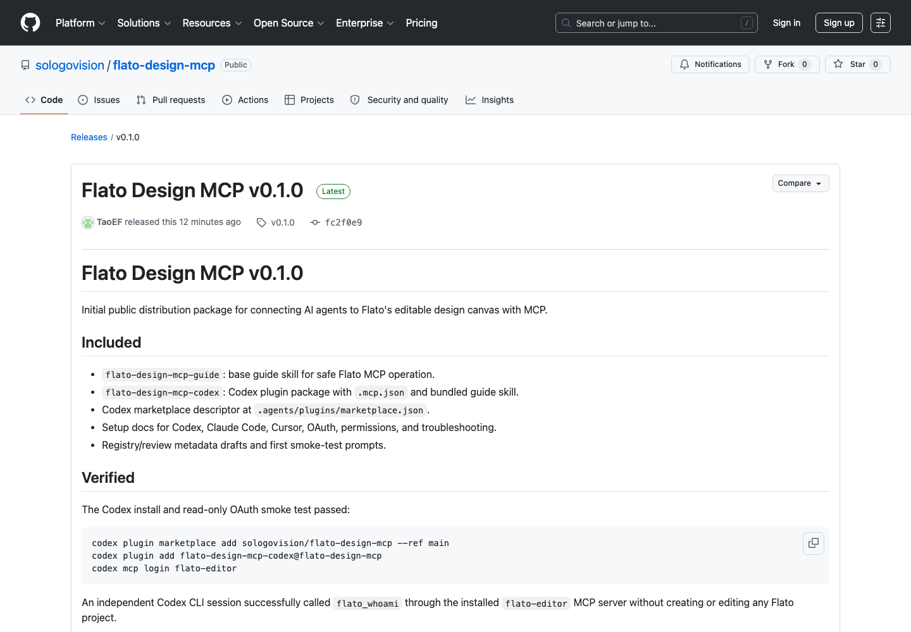
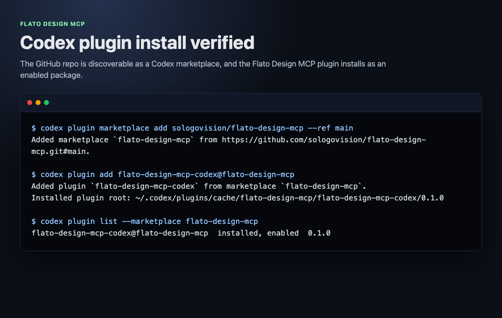
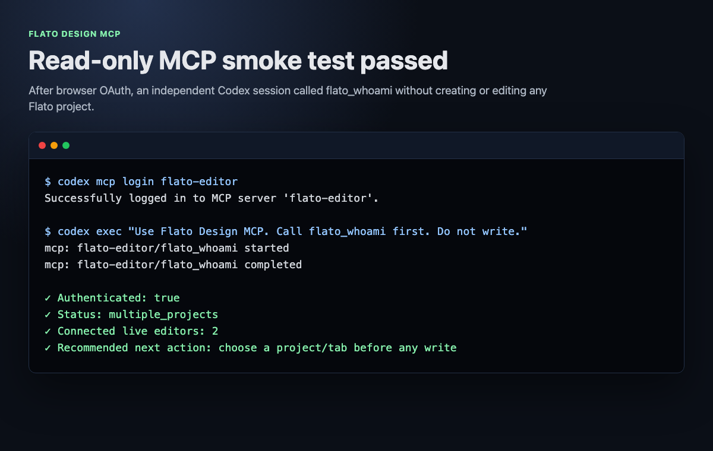
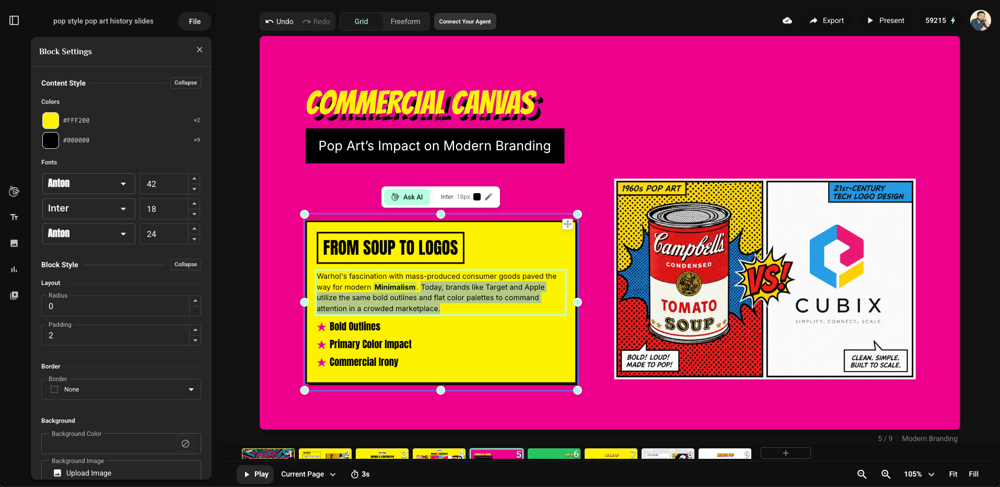
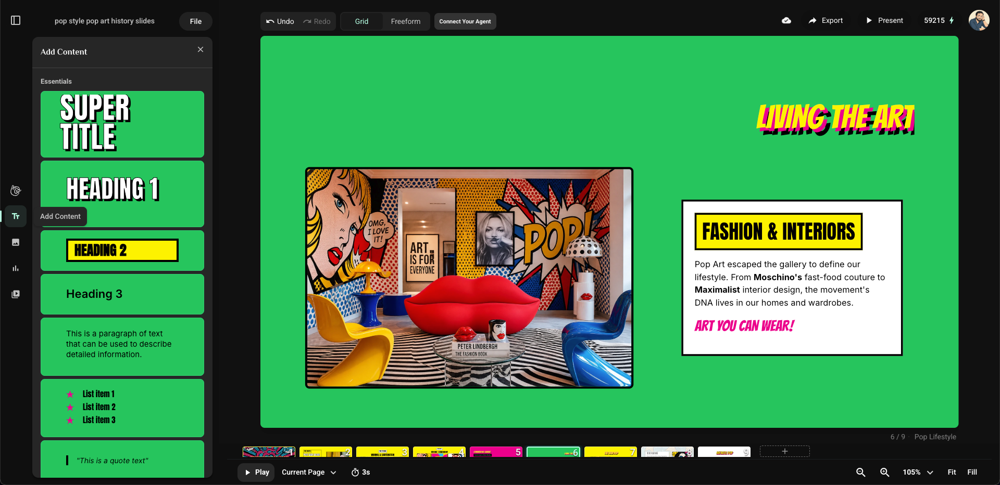
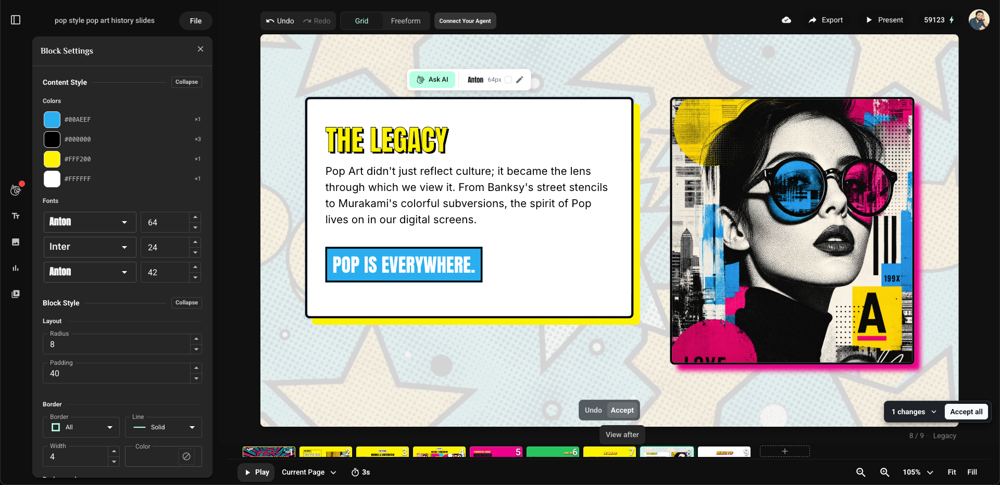
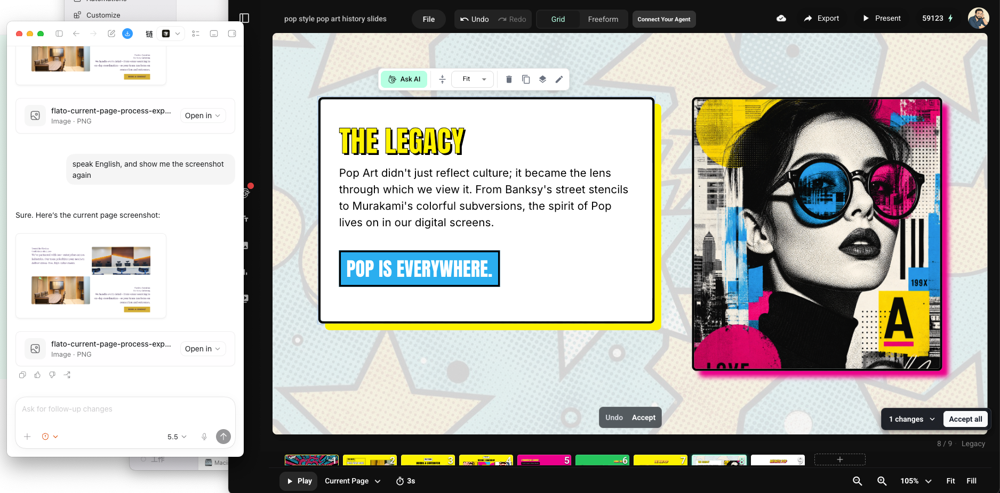

# Flato Design MCP

Connect AI agents to Flato's editable design canvas with MCP.

Flato Design MCP lets Codex, Claude Code, Cursor, and other MCP-capable agents
create, inspect, revise, export, and QA editable Flato design projects. Agents
work through the hosted Flato MCP server while users keep full access to the
live browser editor.

```text
https://api.flato.ai/api/mcp/editor
```

This repository is the official distribution package for setup docs, the base
guide skill, Codex plugin packaging, examples, and registry/review metadata. It
does not contain the Flato MCP server source code.

## What's Included

- `skills/flato-design-mcp-guide`: installable base guide skill for agents.
- `plugins/flato-design-mcp-codex`: Codex plugin package with MCP config and the
  guide skill.
- `.agents/plugins/marketplace.json`: Codex marketplace descriptor for this
  repo.
- `docs/`: setup, OAuth, permissions, and troubleshooting notes.
- `registry/`: MCP registry and platform review metadata drafts.
- `examples/prompts/`: first prompts for testing the integration.

## Codex Install

Codex can install this repo as a plugin marketplace:

```bash
codex plugin marketplace add sologovision/flato-design-mcp --ref main
codex plugin add flato-design-mcp-codex@flato-design-mcp
codex mcp login flato-editor
```

Then open a new Codex conversation and verify:

```text
Use Flato Design MCP. Call flato_whoami first and report the result. Do not create, edit, or write any project.
```

See [Codex setup](docs/setup-codex.md).

## Claude Code Install

Add the hosted Flato MCP server:

```bash
claude mcp add --transport http flato-editor https://api.flato.ai/api/mcp/editor
```

Then use the guide skill in `skills/flato-design-mcp-guide`.

See [Claude Code setup](docs/setup-claude-code.md).

## Cursor And Other MCP Clients

Use the hosted MCP server URL:

```text
https://api.flato.ai/api/mcp/editor
```

Then follow the workflow in `skills/flato-design-mcp-guide/SKILL.md`.

See [Cursor setup](docs/setup-cursor.md).

## OAuth

Flato Design MCP uses browser OAuth. If needed, Flato asks you to sign in or
create an account before authorization.

Do not paste Flato passwords, bearer tokens, refresh tokens, or local OAuth
cache contents into an agent conversation.

See [Authentication](docs/authentication.md).

## Account And Subscription

A Flato account is required for OAuth. A paid Flato subscription is not required
to install, connect, or start using Flato Design MCP.

Some features, exports, higher usage, team/workspace capabilities, or paid image
generation and editing may still depend on the authenticated user's Flato plan
or credits. Agents should report plan or credit errors from MCP instead of
asking users to subscribe in advance.

## First Agent Workflow

After connecting Flato MCP, an agent should:

1. Call `flato_whoami`.
2. Create or select a project with `flato_create_project`,
   `flato_use_project`, or `flato_use_share_link`.
3. Open the live Flato editor when requested.
4. Poll `flato_get_project_status` until `canWrite=true`.
5. Read `flato://canvas/fundamentals-v1`, or call
   `flato_get_canvas_fundamentals` if resource reading is unavailable.
6. Call `flato_get_design_context` before any write.
7. Use concrete page and block ids returned by fresh context reads.
8. Inspect `mcpFeedback` after writes.
9. Export and visually QA important results.

## Interactions

Page-level interactions are authored through `interactiveScript` on
`flato_create_pages` and `flato_update_pages`. Agents should rely on current
MCP tool schemas and `flato://canvas/fundamentals-v1` for the full interaction
contract instead of copying static schema fragments from this repo.

Supported inline interaction events include click/input/change and desktop
hover/mouse events such as `onclick`, `onmouseover`, `onmouseout`,
`onmouseenter`, and `onmouseleave`. Hover is useful for desktop presentations;
include click/tap behavior or a visible fallback when mobile touch users matter.

## Verified Smoke Test

The v0.1.0 Codex path has been verified with:

```bash
codex plugin marketplace add sologovision/flato-design-mcp --ref main
codex plugin add flato-design-mcp-codex@flato-design-mcp
codex mcp login flato-editor
```

An independent Codex CLI session successfully called `flato_whoami` through the
installed `flato-editor` MCP server without creating or editing any Flato
project.

## Screenshots

### GitHub release



### Codex plugin install



### Read-only MCP smoke test



### Editable presentation canvas



### Canvas editing and content tools



### AI-assisted canvas edits



### Codex working with the live canvas



## Release Assets

GitHub releases attach:

- `flato-design-mcp-guide-vX.Y.Z.zip`: installable base guide skill.
- `flato-design-mcp-codex-vX.Y.Z.zip`: Codex plugin package.

## Safety Principles

- Do not ask users to paste passwords, bearer tokens, or local OAuth tokens.
- Do not inspect local OAuth or token stores.
- Do not guess `pageId` or `blockId`.
- Do not claim generated assets are placed until a design write uses the
  returned asset URL.
- Use backups before broad or risky edits.

## Related Flato Docs

- User docs: https://www.flato.ai/docs/mcp
- Agent-readable guide: https://www.flato.ai/docs/mcp.md
- Flato app: https://www.flato.ai
- Privacy: https://www.flato.ai/docs/privacy-policy
- Terms: https://www.flato.ai/docs/terms-of-use

## Support And Security

- Use GitHub Issues for setup and documentation problems.
- See [SECURITY.md](SECURITY.md) for security reporting guidance.
- Do not include tokens, passwords, or private project content in public issues.

## Roadmap

This is the base package. Scenario-specific skills such as
`flato-presentation-skill` should build on this guide instead of duplicating the
connection, OAuth, targeting, and safety workflow.
